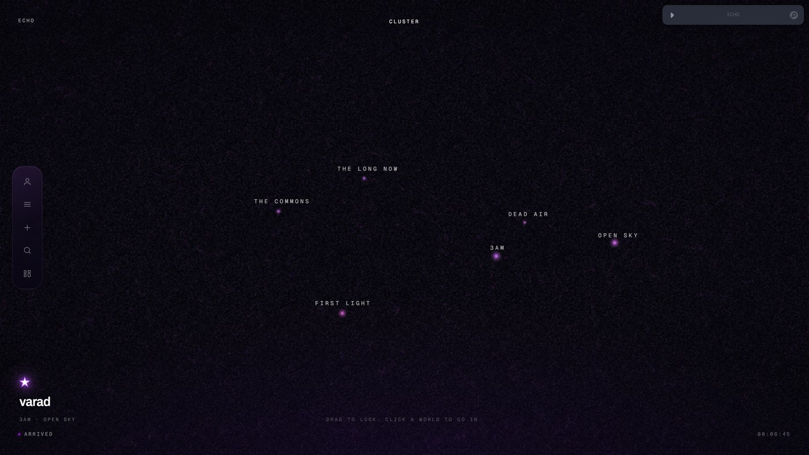
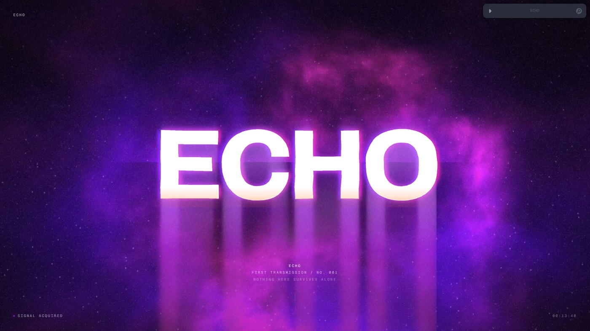
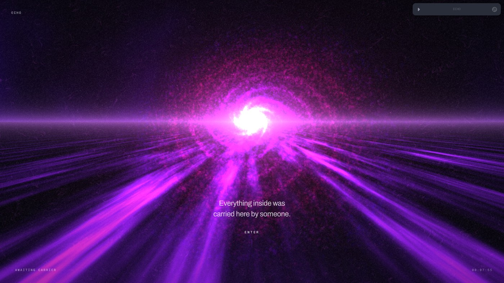
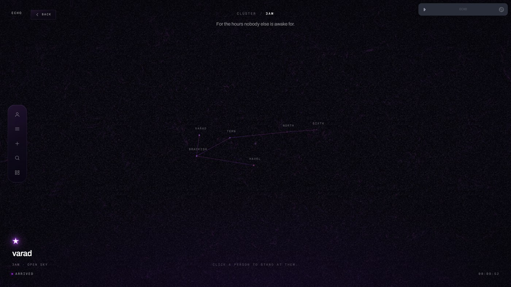
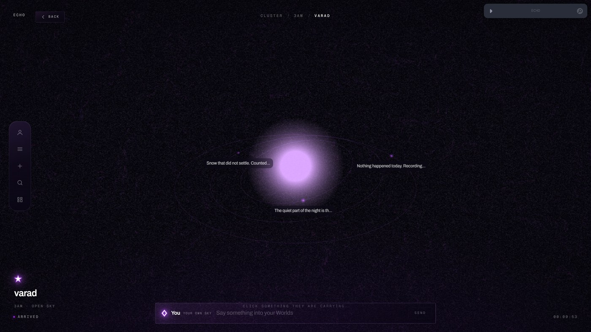
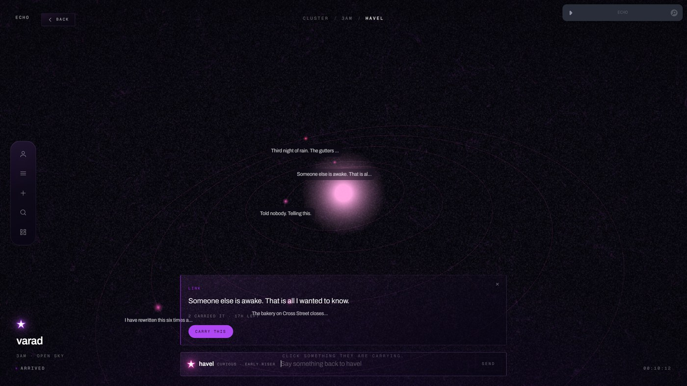
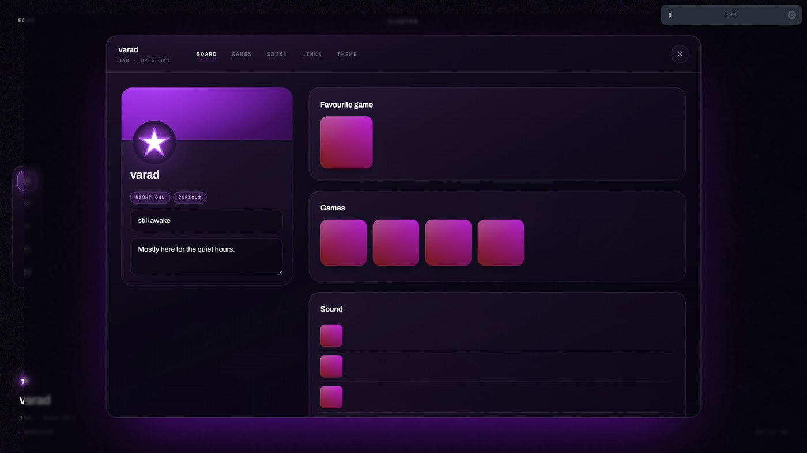
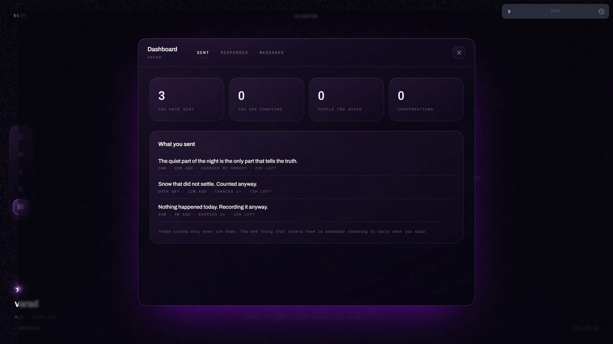
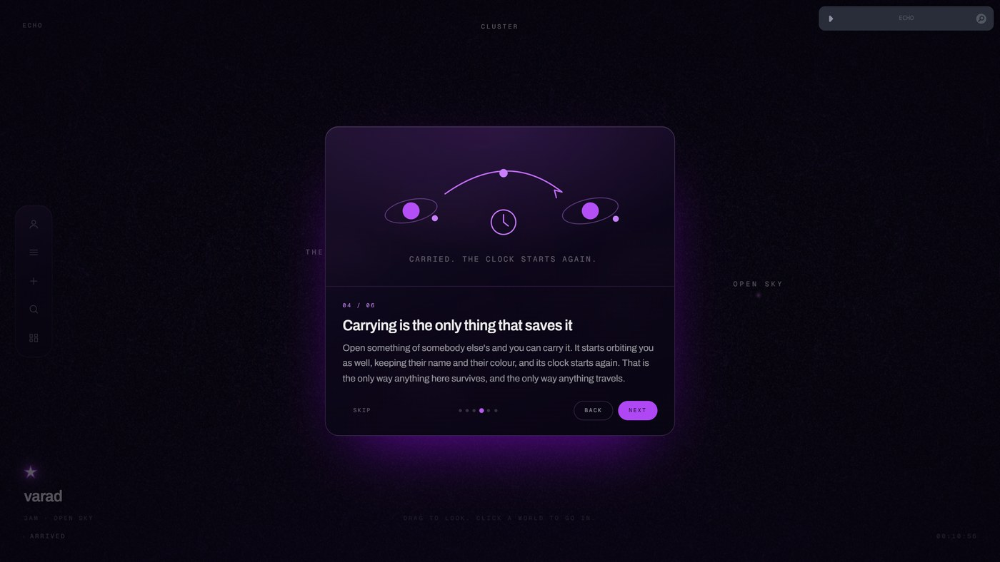
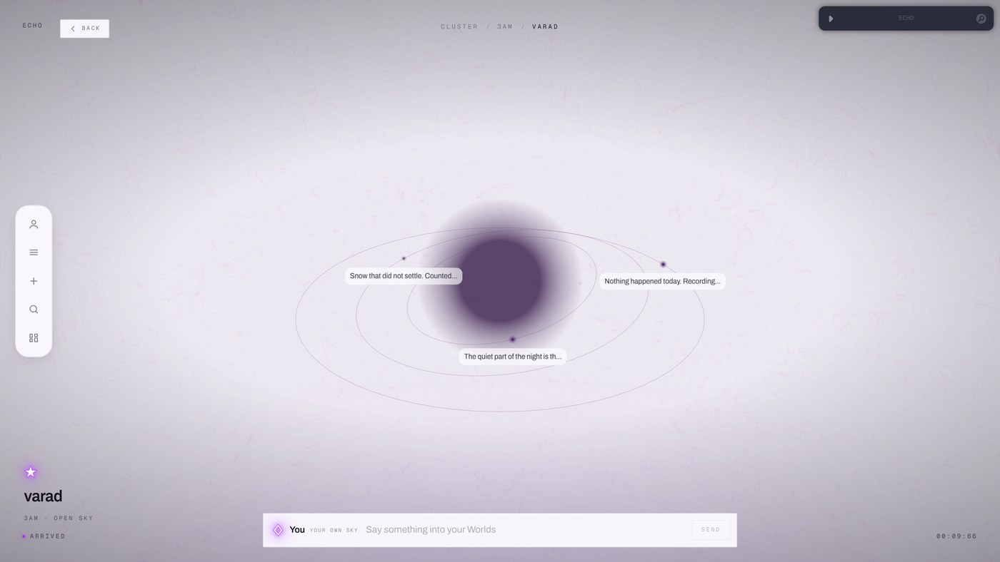

# ECHO

### [Open the sky →](https://varadharajanv0310.github.io/ECHO/) · [Field guide →](https://varadharajanv0310.github.io/ECHO/guide.html)



A social platform where content does not belong to you. It belongs to a place,
it travels through people, and it dies if nobody carries it.

You emit a **signal** into a **World** — a place, a topic, a moment. It never
sits on your profile. From there it travels outward only when a human chooses
to carry it. Reach is earned one hop at a time. A signal that lands travels far.
A signal that lands with nobody fades and is gone — in twelve hours, a day or
three, depending on what you gave it.

There is no ranking function anywhere in the system, no followers, no likes, no
view counts, no paid reach, no infinite scroll, and no data collection. None of
these are enforced rules. They are consequences of the architecture, which is
the strongest form of the claim.

Built for **The Frontend Odyssey 2026**. Frontend only — no backend, no
database, no server-side code. Everything runs in the browser on a static build,
and nothing ever leaves it.

---

## Running it

```bash
pnpm install
```

```bash
pnpm dev
```

The dev server runs on port 5180.

```bash
pnpm build
```

## Reviewing it

The whole thing is one continuous piece of choreography, so reviewing a later
beat should not mean replaying the earlier ones every time.

| URL | What it does |
| --- | --- |
| `/` | Normal entry. First visit runs the full sequence. |
| `/?reset` | Clears the stored profile and replays from the void. |
| `/?phase=galaxy` | Jumps straight to a beat. Any phase name works. |
| `/?phase=passage&p=0.62` | Jumps to a point inside the passage. |
| `/?debug` | Opens the tuning panel on the deployed build. |

Phase names: `void`, `reveal`, `passage`, `galaxy`, `ignition`, `profile`,
`dive`, `constellation`.

A jump lands **settled** rather than animating in from component defaults —
uniforms snap to target on the first frame — so reviewing a later beat is never
a race against the damping.

### The tuning panel

`leva` is mounted in development and behind `?debug` in production. Grain
amount, speck size, bite and cadence; particle count and density; nebula boost;
road and galaxy exposure; vignette.

Everything is a **multiplier over the per-phase mix**, so dragging a slider
scales the whole curve rather than flattening the relationship between phases.
Exposure knobs are written to a plain mutable object and read inside animation
frames, never rendered from — otherwise every pixel of slider movement would
re-render the tree.

---

## The sequence

| Beat | State | What happens |
| --- | --- | --- |
| 1 | `void` | Loading. Starfield, nebula cloud, a falling figure. |
| 2 | `reveal` | The void stains. ECHO resolves out of the nebula. |
| 3–5 | `passage` | The bleed becomes a road. Six stops. The galaxy appears. |
| 6 | `galaxy` | The only interactive object on the page. |
| 7a | `ignition` | A sub drops, a spark ignites, the frame blows out. |
| 7b | — | A returning visitor skips 7a and 8 and dives straight in. |
| 8 | `profile` | Name, mark, colour, Worlds. No email, no password. |
| 9 | `dive` | The warp. |
| 10 | `constellation` | Arrival. The sky settles. |


*Beat 2. The bleed is an SVG `feGaussianBlur` with a two-value `stdDeviation`,
blurring six times harder vertically than horizontally, so every letter stem
becomes its own falling strand.*


*Beat 6. Click it.*

Two structural decisions carry the whole thing:

**Beats 1 and 2 are one component.** The void does not unmount and the reveal
does not mount. The nebula, the figure and the wordmark are all present
throughout; only their visibility changes. That is what lets the void *stain*
into the reveal instead of cutting to it.

**Beats 3 through 10 are one canvas.** Road, galaxy, warp and constellation are
objects inside a single world with a single camera, mounted once and never
unmounted. Moving between them is a camera move and a crossfade of uniforms
rather than four components tearing down and rebuilding — which is the only way
the handoffs are genuinely seamless rather than well-timed.

---

## The sky, once you are in it

Four levels, and the trail across the top always says which one you are in.

| Level | What it is | What you can do |
| --- | --- | --- |
| Cluster | Six places | Drag to look. Click a place to fly into it. |
| Place | The people standing in it, joined into a figure | Click a person to stand at them. |
| Person | Their star, with their signals on rings around it | Click a signal to read it. Click them again to open who they are. |
| Signal | One thing somebody said | Read it, reply, or **carry** it. |


*A place. Only the people standing in it are drawn, and the figure between them
is a nearest-neighbour chain — you are joined to it when you arrive.*


*Standing at somebody. Their signals orbit them, newest closest in, each
labelled with what it actually says.*

**Carrying is the only verb that matters.** Opening somebody else's signal lets
you carry it: it starts orbiting your star as well, keeps their name and their
colour, is labelled *via them*, and its clock restarts. It is the only way
anything travels and the only way anything survives. Put it down and nothing
else is holding it up.


*Opening a signal. How many people are carrying it, how long it has left, and
the one button that changes anything for anybody else.*

**Colour is identity.** Everyone picks a hue. It tints their star, their
profile window, and your cursor while you are with them, through a single
`--accent-h` custom property that every glass surface derives from. Nothing in
the interface hardcodes a violet. A carried signal keeps *its author's* hue, so
your own system shows at a glance what you wrote and what you are holding for
other people.

**Amber is reserved.** It is the only warm colour in the palette and it means
one thing: dying. It is deliberately absent from the colours you can pick for
yourself.

### The five controls

| | |
| --- | --- |
| **Profile** | Name, one line, mark, banner, colour; shelves for games and music from a catalogue with generated cover art; handles for anywhere else you are. |
| **Menu** | Ground and accent, grain, reduced flashing, what reaches you, the opening sequence again, the tutorial again, the field guide. |
| **Create** | Choose a place, write it, give it 12 hours / a day / three days. It appears immediately, orbiting your star. |
| **Search** | Signals and people. Results are scrambled by a hash of the id — stable between renders, and unrelated to who wrote a thing or when. There is no best result in a place with no scores. |
| **Dashboard** | Split three ways: what you **sent** and how long it has left, what came **back**, and the people you are actually **talking to**. |


*A profile. The window is tinted by that person's hue — visiting somebody
should feel like walking into their room, not reading their row in a database.*


*The dashboard. Every clock runs down; the only thing that resets one is
somebody choosing to carry what you said.*

### Onboarding

ECHO does almost nothing a social network is expected to do, so somebody landing
in the sky has no feed to scroll and no obvious next click. A tour runs once per
browser: a welcome, six cards on what the place is, then a pass along the rail
with each control lit in turn and a note beside it. The card art is drawn rather
than screenshotted — half of what needs explaining is not a state the interface
is ever in at one moment. It can be replayed from the menu.



The longer version is the **[field guide](https://varadharajanv0310.github.io/ECHO/guide.html)**,
which ships from the same build.

### Light mode

Not an inversion. The mode is a `uLight` uniform inside each shader, so hues
survive and glow becomes pigment — the sun at a person's star turns from a
bright core into dense ink on paper. In the interface, type comes from `--ink`
in three weights defined once per mode, so a new surface is legible in both
without being remembered twice.



---

## Structure

```
src/
  beats/        one folder per beat of the entry sequence
  components/
    layers/     persistent fixed layers (grain, vignette)
    ui/         the three provided components, modified
  scene/        the persistent r3f canvas and everything in it
    sky-data.ts the generated hierarchy, and where you are placed in it
  shaders/      GLSL, imported through vite-plugin-glsl
  store/        sequence phase machine, sky navigation, tour
  ui/           everything that lives over the sky
    panels/     menu, create, search, dashboard
  lib/          scroll, audio, echoes, library, tuning, maths
  copy.ts       every word in the interface
public/
  guide.html    the field guide, shipped alongside the app
refs/           reference imagery, not shipped
```

**Stack.** Vite, React 19, TypeScript, Tailwind v4, three.js / react-three-fiber
/ postprocessing, Lenis, zustand. Fonts self-hosted via Fontsource. `leva` is a
dev dependency only. No animation library: presence is CSS keyframes gated on a
`data-closing` attribute by a small `useExit` hook, which owns its own unmount
rather than hoping something unmounts late.

---

## Visual identity

**Palette**, sampled from the reference set rather than guessed. The references
mass at hue 258–300 and tail to 324, with almost no warm content anywhere —
which is why amber is rare here too.

| Token | Value | Role |
| --- | --- | --- |
| `--color-void` | `#04030A` | Ground. Near-total black, shifted toward violet. |
| `--color-violet-deep` | `#4F06F8` | The road. |
| `--color-violet` | `#8B2FF8` | Life, propagation. |
| `--color-violet-bright` | `#B026FF` | Resonance. |
| `--color-magenta` | `#FA42B0` | Reach. |
| `--color-amber` | `#FF7326` | **Decay and death only.** Used at a whisper. |
| `--color-spark` | `#FFFFFF` | Ignition. |

Life is violet, death is amber, ignition is white. Brightness carries a hue as
well as a luminance, which is what stops the interface going flat purple.

The rule is enforced by the interface rather than written in a guideline:
**amber is absent from the colours you can choose in profile creation**, because
it is the colour a signal turns when it is dying.

**Type.** Archivo Variable for display — a grotesque that holds at 19vw under a
prism smear, with a width axis the wordmark animates so ECHO physically widens
as it resolves. Geist Mono for system voice, labels and credit blocks.

**Texture.** Film grain over everything at fixed screen density, rendered at DPR
1 so it belongs to the screen and not to the content. It *screens* rather than
overlays, because in a frame that is ninety percent black the grain has to live
in the blacks. It reshuffles at 24fps rather than at display rate — grain that
changes every frame at 120Hz stops looking like emulsion and starts looking like
a broken signal.

**Motion.** Almost everything is still. When something moves, it moved because a
person did. The road only travels while you scroll. The prism smear on the
passage type is scroll-linked rather than timed, so it reports where the reader
is instead of playing on a loop. The constellation orbit is damped by hand
rather than using OrbitControls, because controls that keep sliding would be the
one place the interface stopped agreeing with itself.

---

## Techniques worth naming

**Anisotropic blur is what makes the bleed work.** A CSS `blur()` is isotropic
and gives a soft halo. The references all show light falling in *strands*. An
SVG `feGaussianBlur` with a two-value `stdDeviation` blurs roughly six times
harder vertically than horizontally, which turns every letter stem into its own
falling strand. The same trick, at a different scale, is what turns noise into
lanes on the road.

**The road is a fragment shader, not geometry.** Below the horizon the screen is
reprojected onto a ground plane by the perspective divide, and the noise is
sampled compressed across the road and stretched along it. The reference is
flowing liquid light with no surface and no edges — that is a fragment problem.

**The sky is a hierarchy, not a graph.** An earlier build drew every signal as
one propagation tree, and two hundred nodes at one zoom level is a tangle
nobody can read. It is now four levels you travel through - cluster, place,
person, and the things orbiting them - generated from a seeded PRNG so it is
identical on every visit and on every machine. All of it, every place, person
and signal, is one `THREE.Points` draw call; what changes between levels is a
`uLevel` uniform deciding what is worth looking at. Planets are not positioned
on the CPU at all: the vertex shader derives each orbit from a radius, a phase
and a tilt every frame.

**Decay is derived, never stored.** What the sky does with your signal - who
picks it up, when, and whether anyone ever does - is a hash of the signal's id
against the clock. Identical on every render and across a reload, with no timer
and nothing written down, and about a quarter of signals are never carried at
all. Time is the only input that moves.

**The audio is synthesised, not loaded.** A drone of detuned oscillators through
a moving lowpass, brown noise for air, and short transients for moments a person
caused. Browsers refuse to start audio before a gesture, so it starts on the
first scroll — which is also the first moment anything in the piece moves
because a person moved it.

---

## Notes on the provided components

All three shipped as page-level demos and needed structural changes to work as
layers in a sequence.

**`nebula-shader.tsx`** — the stock `hue()` cycles the full rainbow and puts
cyan and green on screen in the first frame anyone sees; remapped to violet
through magenta with amber only in the brightest cores. It also cleared to
opaque black, which made the persistent particle layer invisible for the whole
of beats 1 and 2 — it now writes premultiplied alpha so light composites over
whatever is underneath. Animated uniforms were effect dependencies, which
relinked the shader program on every change; they are read from a ref inside the
loop instead, and damped. Two layers were added that the loading reference
needs and the stock shader had no notion of: a screen-space starfield and a
domain-warped fbm nebula cloud.

**`fluid-particles-background.tsx`** — was an `h-screen` page wrapper that
centred its children. Now a fixed, non-interactive layer with a damped opacity
prop driven per phase, dark-only, violet-tinted per particle, and DPR-aware.

**`galaxy-warp.tsx`** — deliberately not used as shipped. As a self-contained
opaque `<Canvas>` it cannot enter without a visible cut: an opaque black
rectangle appearing while it compiles shaders and uploads geometry is not
something you can crossfade into. The same maths lives in `scene/WarpField.tsx`
as an object inside the persistent canvas, always resident, accelerating from
nothing and decelerating so the streaks shorten back into stars.

---

## Known scope

Desktop is the target, per the brief and the hackathon's "webapp" framing. A
deliberately art-directed mobile treatment — tighter camera bounds and larger
nodes rather than a shrunken desktop layout — is the next piece of work.

There is no network between browsers, so there is nobody else really online.
Everyone in the sky is generated and so is what they do with your signals; the
mechanic is modelled honestly rather than mocked up, but it is a working
argument, not a product with users.

## Deploying

Pushes to `main` build and publish to GitHub Pages automatically.
